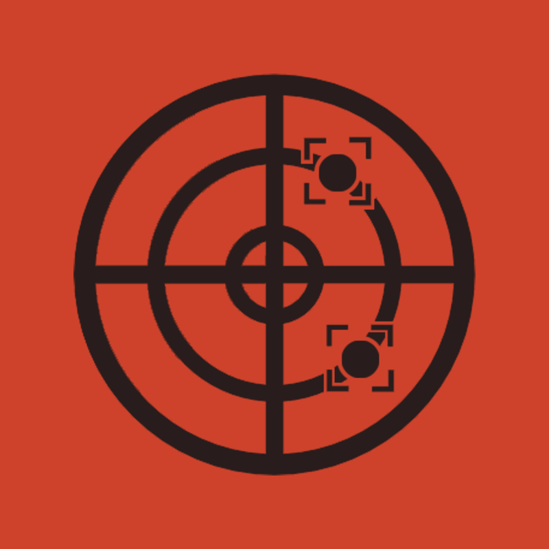
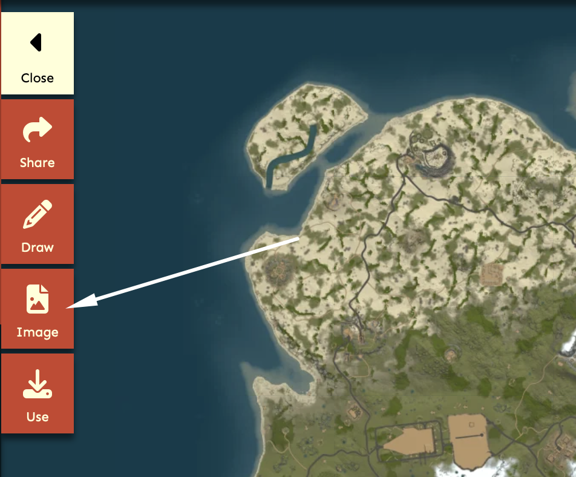

<!-- Improved compatibility of back to top link: See: https://github.com/erobin27/Rust-DMA_Frontend/pull/73 -->

<a name="readme-top"></a>

<!--
*** Thanks for checking out the Best-README-Template. If you have a suggestion
*** that would make this better, please fork the repo and create a pull request
*** or simply open an issue with the tag "enhancement".
*** Don't forget to give the project a star!
*** Thanks again! Now go create something AMAZING! :D
-->

<!-- PROJECT SHIELDS -->
<!--
*** I'm using markdown "reference style" links for readability.
*** Reference links are enclosed in brackets [ ] instead of parentheses ( ).
*** See the bottom of this document for the declaration of the reference variables
*** for contributors-url, forks-url, etc. This is an optional, concise syntax you may use.
*** https://www.markdownguide.org/basic-syntax/#reference-style-links
-->

[![Contributors][contributors-shield]][contributors-url]
[![Forks][forks-shield]][forks-url]
[![Stargazers][stars-shield]][stars-url]
[![Issues][issues-shield]][issues-url]
[![MIT License][license-shield]][license-url]
[![LinkedIn][linkedin-shield]][linkedin-url]

<!-- PROJECT LOGO -->
<br />
<div align="center">
  <a href="https://github.com/erobin27/Rust-DMA_Frontend">
    
  </a>

  <h3 align="center">Rust Radar (Frontend)</h3>

  <p align="center">
    A visualization of the in game data for the game Rust!
    <br />
    <a href="https://github.com/erobin27/Rust-DMA_Frontend"><strong>Explore the docs »</strong></a>
    <br />
    <br />
    <a href="https://github.com/erobin27/Rust-DMA_Frontend">View Demo</a>
    ·
    <a href="https://github.com/erobin27/Rust-DMA_Frontend/issues/new?labels=bug&template=bug-report---.md">Report Bug</a>
    ·
    <a href="https://github.com/erobin27/Rust-DMA_Frontend/issues/new?labels=enhancement&template=feature-request---.md">Request Feature</a>
  </p>
</div>

<!-- TABLE OF CONTENTS -->
<details>
  <summary>Table of Contents</summary>
  <ol>
    <li>
      <a href="#about-the-project">About The Project</a>
      <ul>
        <li><a href="#built-with">Built With</a></li>
      </ul>
    </li>
    <li>
      <a href="#getting-started">Getting Started</a>
      <ul>
        <li><a href="#prerequisites">Prerequisites</a></li>
        <li><a href="#installation">Installation</a></li>
      </ul>
    </li>
    <li><a href="#usage">Usage</a></li>
    <li><a href="#roadmap">Roadmap</a></li>
    <li><a href="#contributing">Contributing</a></li>
    <li><a href="#license">License</a></li>
    <li><a href="#contact">Contact</a></li>
    <li><a href="#acknowledgments">Acknowledgments</a></li>
  </ol>
</details>

<!-- ABOUT THE PROJECT -->

## About The Project


This project accepts incoming data via webhook to visualize the data as a radar. The backend method of retrieving the data is irrelevant, the frontend can work as long as the contract is as outlined.

Since this radar is written in typescript with modern day frontend practices it is possible to use all node packages you would in a typical frontend project. This eliminates the hard to use c++ strategies of building a radar.

The project is designed to be extensible and work with other games as well with only minor tweaks!

<p align="right">(<a href="#readme-top">back to top</a>)</p>

### Built With

- [![React][React.js]][React-url]
- [![Three][Three.js]][Three-url]
- [![MUI][MUI]][MUI-url]

<p align="right">(<a href="#readme-top">back to top</a>)</p>

<!-- GETTING STARTED -->

## Getting Started

Setting up the app is very straight forward as long as you have yarn installed you will be able to start it no problem.

### Prerequisites

Start the backend websocket server that will get the game data and enter in the websocket url in the `.env` file. Also be sure to note whether the data coming from the websocket will be encrypted and the value used for encryption on the backend.

```bash
VITE_WEBSOCKET_HOST='192.168.1.30'
VITE_WEBSOCKET_PORT='1234'
VITE_ENCRYPTION_ENABLED='true'
VITE_ENCRYPTION_KEY='75'
```

#### Finding the map

_There are two methods of finding the in game map to use for the radar visualization. Option 1 can be performed in game and is fairly simple to do. Option 2 utilizes a third party website and works for most servers._

**Option 1: via console**

1. Join the game server you want to play in.
2. Open the rust console and enter the command `world.rendermap`
3. Find the map file in `/steamapps/commond/rust`
4. Move the file to the frontend project
5. Update the name to be `map.png` and override the existing map

**Option 2: via rustmaps website**

1. Navigate to [rustmaps](https://rustmaps.com)
2. Search for the server you are going to play via the server search button (top left)
3. Select the image tab to open up options
   
4. Choose the option to open the image in a new tab
5. You should have a page with a url like https://content.rustmaps.com/maps/250/b48df73279a640318048e4147c2f6d7d/map_raw_normalized.png
6. Replace `map_raw_normalized.png` with `map_raw.png` in the url and hit enter
7. This will bring up a 1:1 accurate map, you can right click and download this map to the project and save it as map.png

### Installation

_Below is an example of how you can instruct your audience on installing and setting up your app. This template doesn't rely on any external dependencies or services._

1. Install the project dependencies
   ```sh
   yarn install
   ```
2. Follow prerequisite steps to download the map to `/public/map/map.png` by following the guide above to find the map.
3. Start the frontend webserver
   ```sh
   yarn start
   ```

<p align="right">(<a href="#readme-top">back to top</a>)</p>

## Features

- [x] Recoil Viewer
- [x] Recoil Adjuster (no recoil)
- [x] Visualize Items
- [x] Visualize Players
- [x] Visualize Weapons

- [ ] Visualize dead bodies
- [ ] Visualize Animals

See the [open issues](https://github.com/erobin27/Rust-DMA_Frontend/issues) for a full list of proposed features (and known issues).

<p align="right">(<a href="#readme-top">back to top</a>)</p>

## License

Distributed under the MIT License. See `LICENSE.txt` for more information.

<p align="right">(<a href="#readme-top">back to top</a>)</p>

<!-- CONTACT -->

## Contact

Your Name - [@your_twitter](https://twitter.com/your_username) - email@example.com

Project Link: [https://github.com/your_username/repo_name](https://github.com/your_username/repo_name)

<p align="right">(<a href="#readme-top">back to top</a>)</p>

<!-- ACKNOWLEDGMENTS -->

## Acknowledgments

Use this space to list resources you find helpful and would like to give credit to. I've included a few of my favorites to kick things off!

- [Choose an Open Source License](https://choosealicense.com)
- [GitHub Emoji Cheat Sheet](https://www.webpagefx.com/tools/emoji-cheat-sheet)
- [Malven's Flexbox Cheatsheet](https://flexbox.malven.co/)
- [Malven's Grid Cheatsheet](https://grid.malven.co/)
- [Img Shields](https://shields.io)
- [GitHub Pages](https://pages.github.com)
- [Font Awesome](https://fontawesome.com)
- [React Icons](https://react-icons.github.io/react-icons/search)

<p align="right">(<a href="#readme-top">back to top</a>)</p>

<!-- MARKDOWN LINKS & IMAGES -->
<!-- https://www.markdownguide.org/basic-syntax/#reference-style-links -->

[contributors-shield]: https://img.shields.io/github/contributors/erobin27/Rust-DMA_Frontend.svg?style=for-the-badge
[contributors-url]: https://github.com/erobin27/Rust-DMA_Frontend/graphs/contributors
[forks-shield]: https://img.shields.io/github/forks/erobin27/Rust-DMA_Frontend.svg?style=for-the-badge
[forks-url]: https://github.com/erobin27/Rust-DMA_Frontend/network/members
[stars-shield]: https://img.shields.io/github/stars/erobin27/Rust-DMA_Frontend.svg?style=for-the-badge
[stars-url]: https://github.com/erobin27/Rust-DMA_Frontend/stargazers
[issues-shield]: https://img.shields.io/github/issues/erobin27/Rust-DMA_Frontend.svg?style=for-the-badge
[issues-url]: https://github.com/erobin27/Rust-DMA_Frontend/issues
[license-shield]: https://img.shields.io/github/license/erobin27/Rust-DMA_Frontend.svg?style=for-the-badge
[license-url]: https://github.com/erobin27/Rust-DMA_Frontend/blob/master/LICENSE.txt
[linkedin-shield]: https://img.shields.io/badge/-LinkedIn-black.svg?style=for-the-badge&logo=linkedin&colorB=555
[linkedin-url]: https://linkedin.com/in/othneildrew
[product-screenshot]: images/screenshot.png
[Next.js]: https://img.shields.io/badge/next.js-000000?style=for-the-badge&logo=nextdotjs&logoColor=white
[Next-url]: https://nextjs.org/
[React.js]: https://img.shields.io/badge/React-20232A?style=for-the-badge&logo=react&logoColor=61DAFB
[React-url]: https://reactjs.org/
[Three.js]: https://img.shields.io/badge/Three.js-FFFFFF?style=for-the-badge&logo=threedotjs&logoColor=000000
[Three-url]: https://threejs.org
[MUI]: https://img.shields.io/badge/Material%20UI-FFFFFF?style=for-the-badge&logo=mui&logoColor=#007fff
[MUI-url]: https://mui.com/material-ui/
[Vue.js]: https://img.shields.io/badge/Vue.js-35495E?style=for-the-badge&logo=vuedotjs&logoColor=4FC08D
[Vue-url]: https://vuejs.org/
[Angular.io]: https://img.shields.io/badge/Angular-DD0031?style=for-the-badge&logo=angular&logoColor=white
[Angular-url]: https://angular.io/
[Svelte.dev]: https://img.shields.io/badge/Svelte-4A4A55?style=for-the-badge&logo=svelte&logoColor=FF3E00
[Svelte-url]: https://svelte.dev/
[Laravel.com]: https://img.shields.io/badge/Laravel-FF2D20?style=for-the-badge&logo=laravel&logoColor=white
[Laravel-url]: https://laravel.com
[Bootstrap.com]: https://img.shields.io/badge/Bootstrap-563D7C?style=for-the-badge&logo=bootstrap&logoColor=white
[Bootstrap-url]: https://getbootstrap.com
[JQuery.com]: https://img.shields.io/badge/jQuery-0769AD?style=for-the-badge&logo=jquery&logoColor=white
[JQuery-url]: https://jquery.com
